<div align="center">




</div>

```console
$ whoami --verbose
  capture → compile → verify · the boring layer of the agent supply chain
  a skill you can't replay in a box and explain in a diff is just folklore

$ ls ~/projects
  skilltape   rust        capture a command → reviewable Skill → sandboxed replay → Receipt
  skillsync   typescript  offline provenance / compatibility / drift · never executes the skill
```

[](https://github.com/Chumaniac/skilltape)
[](https://github.com/Chumaniac/skilltape/actions/workflows/ci.yml)
[](https://github.com/Chumaniac/skilltape/tree/main/crates)
[](https://github.com/Chumaniac/skillsync)
[](https://github.com/huangruiteng/loopx/pulls?q=is%3Apr+author%3AChumaniac)

```console
$ telemetry --public
  repos 4 · PRs 15 opened / 15 merged · commits 275 · releases v0.1.0 + v0.1.2
  targets linux-gnu · darwin x86_64/aarch64 · windows-msvc · gates CodeQL + Dependabot
```


