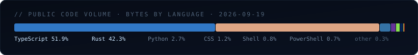

<div align="center">



<br>

[](https://github.com/Chumaniac/skilltape/tree/main/crates)
[](https://github.com/Chumaniac/skillsync)
[](https://github.com/Chumaniac/skilltape/blob/main/LICENSE)
[](https://github.com/Chumaniac/skilltape/blob/main/SECURITY.md)
[](https://github.com/Chumaniac/skilltape#what-works-today)

</div>

## ▘ `whoami`

```text
chumaniac@local ~$ whoami --verbose
```

I build the boring, load-bearing layer of the agent ecosystem: **capture, provenance,
sandboxed replay, verification receipts**. A skill that can't be replayed in a box and
explained in a diff is just folklore.

- **Reviewable artifacts over vibes.** Every run should leave a Receipt someone can read,
  not a memory someone trusts.
- **Fail closed.** No restricted executor on Windows? Replay and Verify refuse rather than
  pretend. `pass / warn / fail / unknown` are findings to review, never an auto-approve.
- **Local-first.** Runs on your machine with no account, no API key, no model provider,
  no config file standing between you and the first result.

## ▛ Projects

| | | |
|---|---|---|
| [**SkillTape**](https://github.com/Chumaniac/skilltape) | Rust · Beta | Capture a command you already run → compile it into a reviewable Agent Skill → replay it in an isolated sandbox → get a Receipt. `bwrap` on Linux, `sandbox-exec` on macOS; unsupported executors fail closed. 10 crates (`capture · compiler · policy · runner · verify · export · schema · tape · core · cli`), checksummed multi-target release assets. |
| [**SkillSync**](https://github.com/Chumaniac/skillsync) | TypeScript · MIT · Alpha | Offline verification for a local Skill: provenance, target compatibility, drift — `verify · scan · compat · diff · fix --plan → fix --apply → report`. It never executes the Skill's scripts, never reads credentials, never calls a provider. |

[](https://github.com/Chumaniac/skilltape/releases/tag/v0.1.0)
[](https://github.com/Chumaniac/skilltape/actions/workflows/ci.yml)
[](https://www.npmjs.com/package/@chumanic/skillsync)
[](https://github.com/Chumaniac/skillsync/tags)
[](https://github.com/Chumaniac/skilltape/commits/main)

Ship path on both: pinned installer fetched from an explicit commit, release base URL kept
visible, `CodeQL` + `Dependabot` + provenance-oriented release workflows wired in CI.

## ▜ Upstream

Contributing to [**huangruiteng/LoopX**](https://github.com/huangruiteng/loopx) — a
long-horizon agent control plane for durable, governed work across Codex, Claude Code and
other harnesses (~5.9k stars). LoopX runs an itemized contributor task board
(`docs/development/contributor-tasks.md`), so each change starts from a claimed `[Task]` issue.

| PR | Scope | Merged |
|---|---|---|
| [#4659](https://github.com/huangruiteng/loopx/pull/4659) | `refactor(cli)`: move the `update` command into its own module — `support_control.py` 898 → 772 lines | 2026-09-17 |
| [#4657](https://github.com/huangruiteng/loopx/pull/4657) | `docs(catalog)`: IP-035 — *install ownership is not an update permission* | 2026-09-17 |

## ▞ Instrument panel

Snapshot as of **2026-09-19**, straight from the GitHub API — no estimator in the loop.

```text
repos (public) ......... 4        commits (default branch) ... 275
PRs opened ............. 15       PRs merged ................. 15  (100%)
releases ............... SkillTape v0.1.0 · SkillSync v0.1.2
targets shipped ........ linux-gnu · apple-darwin (x86_64 + aarch64) · windows-msvc
gates in CI ............ CI · Release · skill-verify · CodeQL · Dependabot · Docker runner
```



## ⌥ Reading list

Where the attention actually goes, from the star graph: **agent runtimes and orchestration**
(`langchain`, `awesome-llm-apps`, parallel-agent consoles), **reverse engineering and
applied security** (`ghidra`, `radare2`, `strix`, `pentagi`, `sherlock`), **supply-chain and
review hygiene** at scale (`open-code-review`), and the occasional 12306 MCP server that
reminds me protocols outlive hype.

## ▓ Interface

```text
issues  →  any repo above, preferred; a repro is a feature
PRs     →  claim a task first, then keep the diff honest
```

<div align="center">

*exit 0 — no credentials, no model calls, no network required to reproduce the receipts.*

</div>
